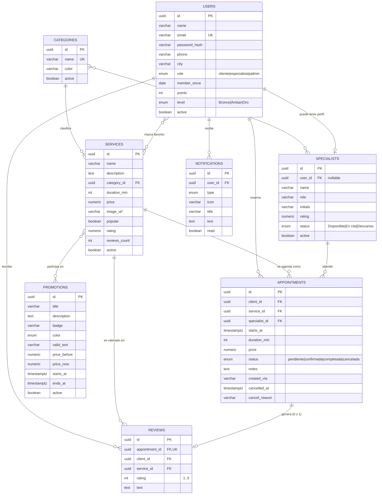

# Modelo de datos

El esquema PostgreSQL se **deriva de las entidades** definidas en `src/modules/*/entities/`.
Las clases con decoradores de TypeORM son la fuente de verdad; la migración
`src/database/migrations/1753660000000-InitialSchema.ts` traduce ese modelo a SQL.

## Diagrama entidad-relación



Tablas de unión: `specialist_categories`, `user_favorite_services`, `promotion_services`.

## Decisiones y su justificación

### 1. `Category` como entidad, no como texto

En el prototipo la categoría era una cadena dentro del servicio. Se convirtió en
tabla porque cumple dos funciones del dominio: agrupa el catálogo que filtra la
clienta y **determina qué especialista puede atender qué servicio**
(`specialist_categories`). Como texto libre, «Uñas» y «uñas» serían categorías
distintas y la asignación automática fallaría.

### 2. `starts_at` en `timestamptz`, no fecha y hora separadas

Guardar un solo instante convierte la detección de solapes en una comparación de
intervalos. El spa opera en `America/Guayaquil`; `timestamptz` evita ambigüedades
cuando la API y la base están en zonas distintas.

### 3. `duration_min` y `price` duplicados en la cita

Son copias del servicio al momento de reservar. Es redundancia deliberada: si el
precio sube o la duración cambia, el historial y los reportes deben seguir
reflejando lo que se acordó ese día. Sin esta copia, un cambio de tarifa
reescribiría retroactivamente los ingresos del mes pasado.

### 4. La cita nunca se borra

Cancelar cambia `status` y registra `cancelled_at` y `cancel_reason`. La franja
queda libre porque la disponibilidad sólo considera estados `pendiente` y
`confirmada`, y la tasa de cancelación —indicador de la tesis— se puede calcular.

### 5. Sin columna `reviewed` en la cita

Se deriva de la relación uno a uno con `reviews`, que además es `UNIQUE` sobre
`appointment_id`. Un booleano paralelo podría desincronizarse de la tabla real.

### 6. Restricción de solapes en la base (`appointments_no_overlap`)

```sql
EXCLUDE USING gist (
  specialist_id WITH =,
  tstzrange(starts_at, starts_at + make_interval(mins => duration_min)) WITH &&
) WHERE (status IN ('pendiente','confirmada'))
```

El servicio de citas ya valida disponibilidad antes de insertar, pero dos
reservas simultáneas pueden pasar esa validación a la vez (condición de carrera)
y dejar a una especialista con dos clientas a la misma hora. Esta restricción
lo hace imposible a nivel de base, sin importar cuántas instancias de la API
haya. Requiere la extensión `btree_gist`, disponible en Supabase.

### 7. `rating` y `reviews_count` denormalizados en `services`

Se recalculan al publicar una reseña. El listado del catálogo es la consulta más
frecuente de la aplicación y así no necesita agregar sobre `reviews` cada vez.

### 8. Bajas lógicas (`active`) en servicios y especialistas

Las claves foráneas de `appointments` usan `ON DELETE RESTRICT`: la base impide
borrar un servicio o una especialista con historial. La operación de «eliminar»
del panel administrativo desactiva en ese caso, conservando la trazabilidad.

## Correspondencia con el frontend

| Frontend (`frontend/src/types/index.ts`) | Entidad del backend |
| --- | --- |
| `Service.category` (string) | `services.category_id` → `categories.name` |
| `Service.durationMin`, `price`, `image` | `duration_min`, `price`, `image_url` |
| `Appointment.start` (ISO) | `appointments.starts_at` (timestamptz) |
| `Appointment.serviceName`, `specialistName`, `clientName` | se resuelven por relación y se exponen en el DTO |
| `Appointment.reviewed` | derivado de la relación `reviews` |
| `User.favoriteServices` (nombres) | `user_favorite_services` |
| `Promotion.serviceIds` | `promotion_services` |

La API de la Fase 2 mantendrá **la forma que el frontend ya consume** (por
ejemplo, `category` como texto y `reviewed` como booleano), de modo que conectar
el backend no obligue a tocar componentes.
